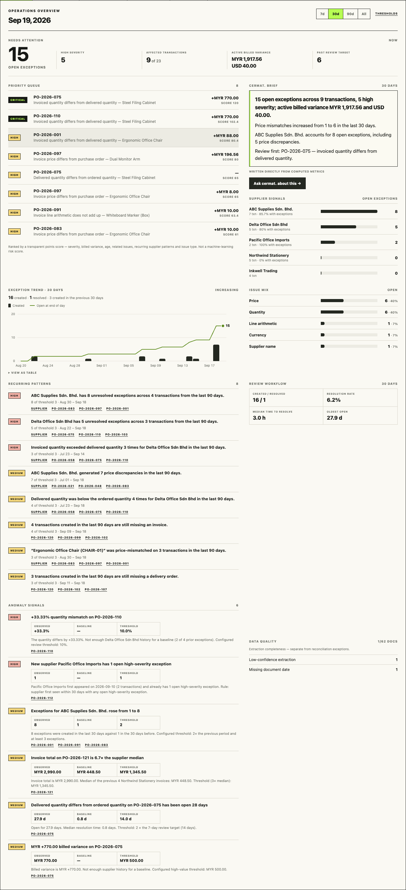
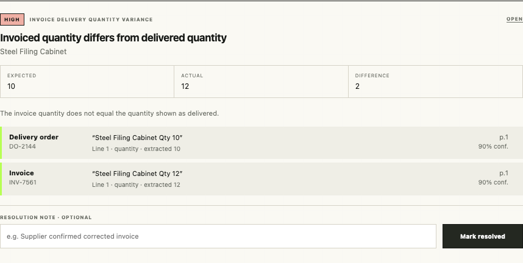
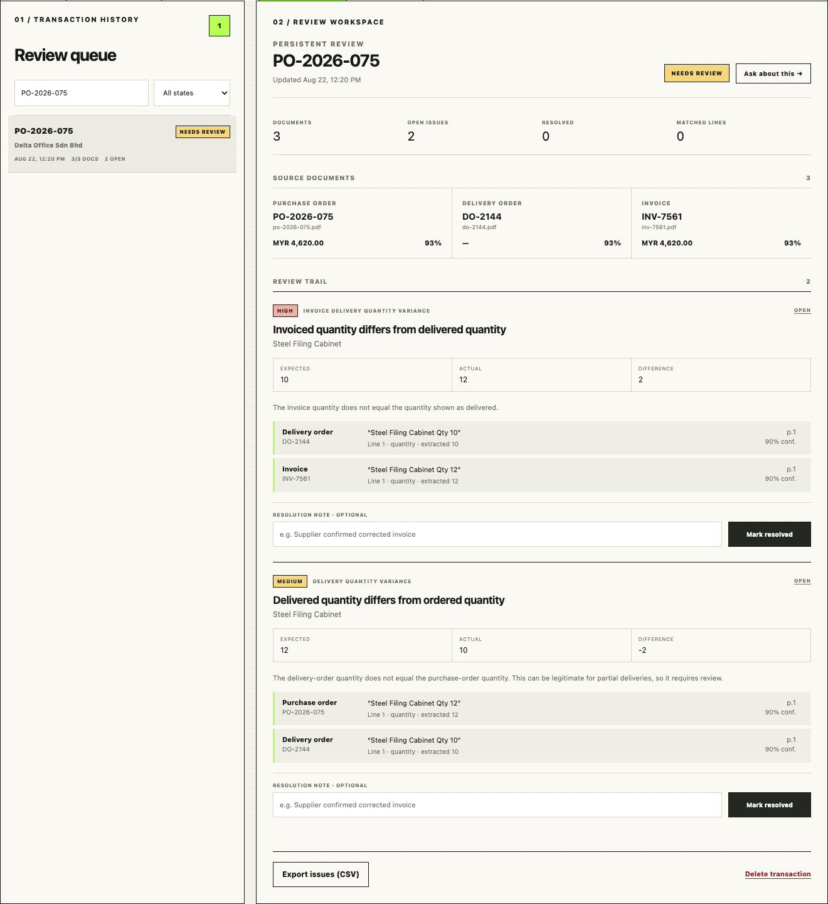
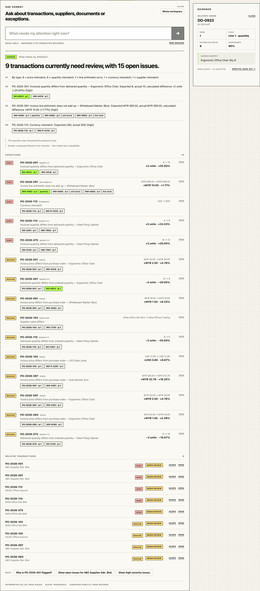
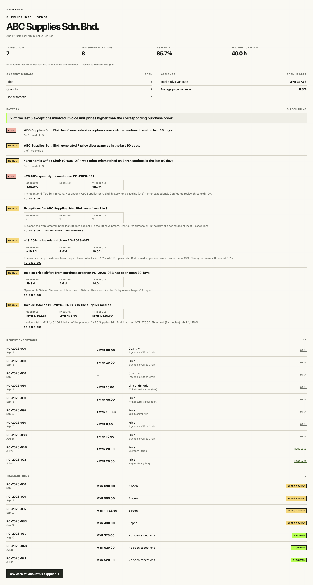

# cermat.

**Evidence-backed AI operations intelligence for purchasing documents.** cermat. reads purchase orders, delivery orders and invoices, verifies them against each other with deterministic rules, and shows reviewers exactly which evidence supports every exception.

```text
AI reads.  Rules verify.  Evidence proves.  cermat. explains.  Humans decide.
```



## Why it exists

Small finance and operations teams still check purchase documents by hand: did we receive what we ordered, and were we billed for what we received? Generic "AI document" tools read the documents but then let a language model *decide* whether numbers agree. That is hard to trust and impossible to audit.

cermat. keeps the AI where it is strong — reading messy documents and explaining results — and keeps every business decision in deterministic, testable code with the source evidence attached.

## What it does

- **Extracts** POs, delivery orders, invoices and receipts (PDF or image) into structured fields and line items. Every value carries the source snippet, page and confidence.
- **Reconciles** PO ↔ DO ↔ invoice with deterministic rules: quantity, unit price, line arithmetic, supplier and currency.
- **Tracks review**: each exception becomes a persistent review issue that people resolve or reopen with a note. Decisions survive re-reconciliation.
- **Ask cermat.**: natural-language questions ("Why is PO-2026-097 flagged?") are mapped to a fixed set of safe query intents and answered from records, with evidence chips.
- **Operations intelligence**: an overview with a priority queue, supplier intelligence, recurring patterns, anomaly signals, trends and a short brief.
- **Workspaces**: accounts, owner/member roles, workspace isolation, an audit trail, CSV export, deletion and a labelled demo workspace.

## Product workflow

```text
Upload PO / DO / Invoice
   → AI extraction (fields + evidence + confidence)
   → deterministic three-way reconciliation
   → review issues with expected / actual / difference and source evidence
   → human resolves or reopens, with a note (audited)
   → Overview, supplier intelligence and attention queue update
   → Ask cermat. answers questions from the same records
```

| | |
|---|---|
|  |  |
|  |  |

Screenshots are of the running app with the demo workspace loaded.

## Architecture

```text
                         ┌──────────────────┐
                         │   Next.js Web    │  same-origin /api/* proxy
                         └────────┬─────────┘  (session cookie stays first-party)
                                  │
                                  ▼
                         ┌──────────────────┐
                         │   FastAPI API    │  auth · workspaces · audit · errors
                         └────────┬─────────┘
                                  │
          ┌───────────────────────┼────────────────────────┐
          │                       │                        │
          ▼                       ▼                        ▼
 ┌────────────────┐      ┌──────────────────┐      ┌────────────────┐
 │ AI Extraction  │      │ Business Rules   │      │ Ask cermat.    │
 │ multimodal     │      │ reconciliation   │      │ safe intents   │
 │ structured     │      │ variance         │      │ retrieval      │
 │ evidence       │      │ priority         │      │ grounded       │
 └───────┬────────┘      │ anomalies        │      │ synthesis      │
         │               └────────┬─────────┘      └───────┬────────┘
         └────────────────────────┼────────────────────────┘
                                  ▼
                         ┌──────────────────┐
                         │   PostgreSQL     │  Alembic migrations
                         └──────────────────┘
                                  +
                         Object file storage (local or S3-compatible)
```

More detail: [docs/architecture.md](docs/architecture.md) · [docs/data-model.md](docs/data-model.md).

## AI vs deterministic logic

| AI (model) | Deterministic code | Human |
|---|---|---|
| Document understanding: fields, line items, evidence snippets | Reconciliation (quantities, prices, arithmetic, supplier, currency) | Review each exception |
| Classifying a question into one of a fixed set of intents | Variance amounts and percentages | Resolve or reopen, with a note |
| Wording grounded answers and the brief from supplied facts | Priority scoring, metrics, trends, anomaly thresholds, patterns | Business decisions |

**How hallucination risk is controlled**

- The model never decides a discrepancy. Code does, and the result is persisted with its evidence.
- Ask cermat. cannot run SQL. The model picks an intent and filter values, and every entity is resolved to a database ID before a fixed query runs.
- Answers are generated only from a compact record set. If a model's answer contains a number that is not in those records, it is discarded and an answer written directly from the records is shown instead.
- The brief is also rejected if it uses accusatory language ("fraud", "suspicious", …).
- Everything works without a model key: keyword planning and record-built answers, clearly labelled.

## Key features

- Evidence on every exception: document, type, page, field, extracted value, snippet, confidence, and a link to open the original file.
- A transparent priority score. Every point is listed as a reason, and "critical" requires a stated rule.
- Recurring-pattern and anomaly rules that show observed value, baseline and threshold. No black-box risk scores.
- Multi-currency variance, reported per currency and never converted.
- Paginated, searchable history; CSV export; per-transaction activity; confirmed deletion.
- Resumable three-way processing. If extraction fails part-way, completed steps are kept and "Retry" resumes.

## Tech stack

- **Web**: Next.js 16, React 19, TypeScript. Plain CSS design system, no UI kit.
- **API**: FastAPI, Pydantic v2, SQLAlchemy 2 (async), Alembic.
- **Data**: PostgreSQL 16. Files on a local volume or S3-compatible storage.
- **AI**: OpenAI Responses API with strict structured outputs (configurable model).
- **Auth**: Argon2id password hashing, server-side sessions, CSRF tokens.
- **Quality**: pytest, ruff, ESLint, tsc, GitHub Actions.

## Local setup

Requirements: Docker with Compose.

```bash
git clone <repo> cermat && cd cermat
cp .env.example .env            # add OPENAI_API_KEY for live extraction (optional)
docker compose up --build       # migrations run automatically on API start
```

Open http://localhost:3000, create an account, then either:

- **Start with a document**: upload a PO, DO and invoice in *Three-way match* (needs `OPENAI_API_KEY`), or
- **Load demo workspace**: a separate workspace labelled **DEMO DATA** with about 23 reconciled transactions. No model key is needed.

To run migrations by hand: `docker compose exec api alembic upgrade head`.

Upgrading a database from before accounts existed? Existing data moves into a *Legacy workspace*. In development the first account you create owns it; in production run `docker compose exec api python -m scripts.claim_legacy_workspace you@example.com`.

## Environment variables

See [.env.example](.env.example). The important ones:

| Variable | Purpose |
|---|---|
| `APP_ENV` | `development`, `test` or `production`. Production refuses insecure defaults at startup. |
| `SECRET_KEY` | HMAC key for session and CSRF token digests (≥ 32 random characters in production) |
| `DATABASE_URL` | PostgreSQL (asyncpg) connection string |
| `OPENAI_API_KEY`, `OPENAI_MODEL` | AI provider. Optional; features degrade gracefully without it. |
| `STORAGE_PROVIDER` | `local` or `s3` (plus `S3_*`) |
| `MAX_UPLOAD_MB`, `MAX_PDF_PAGES` | Upload limits |
| `RATE_LIMIT_AI_PER_MINUTE` | Per-user limit for extraction, Ask and the brief |
| `CORS_ORIGINS` | Only needed if a browser calls the API from another origin |

## Testing

```bash
docker compose exec api pytest            # backend: unit + PostgreSQL integration
docker compose exec api ruff check .
docker compose exec web npm run typecheck
docker compose exec web npm run lint
docker build --target production apps/web # production build
```

- **Unit**: reconciliation, variance, priority scoring, patterns, anomalies, trends, Ask intent routing and grounding, authorization helpers.
- **Integration** (real PostgreSQL, separate `*_test` database): auth, CSRF, uploads, extraction failure recovery, transactions, reconciliation reruns, review, workspace scoping, roles, demo reset, deletion, exports, rate limits, migrations from both a clean and a Phase 6 database.
- **End-to-end smoke** (API level): sign up → upload PO/DO/invoice → extract → reconcile → evidence → resolve → Overview → Ask.
- **Authorization (IDOR)**: a second user probes every resource type (documents, files, transactions, issues, Ask context, suppliers, attention, audit, exports, workspace header) and always gets 404.

CI runs all of this on every push ([.github/workflows/ci.yml](.github/workflows/ci.yml)).

## Security model

- Argon2id passwords, opaque session tokens in httpOnly `SameSite=Lax` cookies (`Secure` in production), and only HMAC digests stored.
- A CSRF token is required on every unsafe request.
- Every business row has a `workspace_id`; every endpoint verifies membership. Foreign resources answer 404.
- Uploads are validated by content (magic bytes), extension, size and page count. Storage keys are server-generated.
- Errors are standardized with request IDs, and there are no stack traces in responses. Logs are structured JSON without secrets.
- There is an append-only audit trail of operational actions.

Details, including known limitations: [docs/security.md](docs/security.md). What is sent to the AI provider: [docs/security.md#privacy](docs/security.md#privacy).

## Deployment

Next.js + FastAPI + managed PostgreSQL + S3-compatible storage. There's a single-host path (`docker-compose.prod.yml`) and a managed-services path: [docs/deployment.md](docs/deployment.md).

## Demo

A 2–3 minute walkthrough script: [docs/demo.md](docs/demo.md).

## Future work

- A page-level document viewer that highlights the evidence region (the API already exposes `preview_url`).
- Background extraction queue for very large batches (currently synchronous per document, which is sufficient at SME volumes).
- Email invitations for workspace members (members currently need an existing account).
- A shared rate-limit store when running many API replicas.
